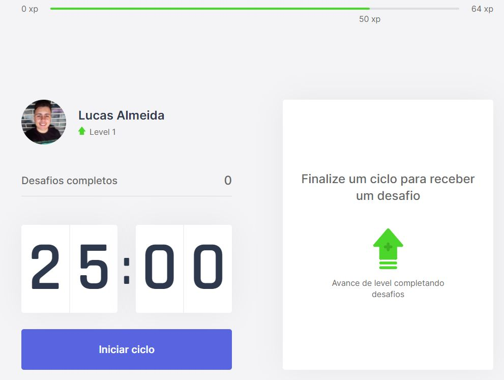
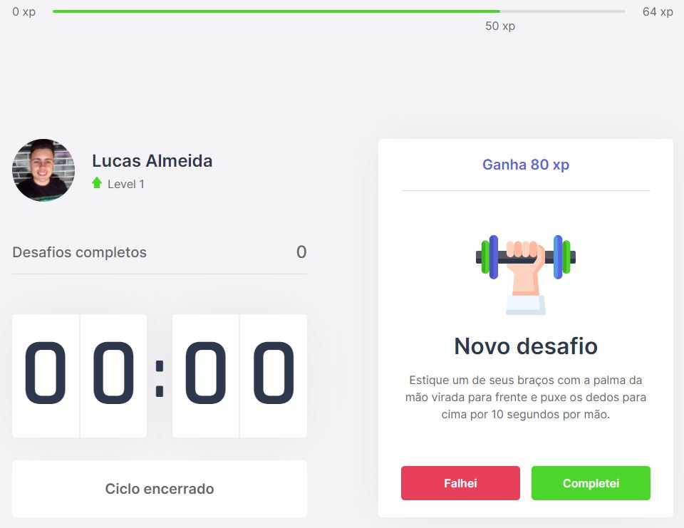

<p align="center">
   
</p>

# :page_with_curl: Table of Contents

* [About](#information_source-about)
* [Technologies](#computer-technologies)
* [Features](#rocket-features)
* [Images](#camera-images)
* [How to run](#seedling-how-to-run)
* [License](#pencil-license)

# :information_source: About

Move.it is a web application that aims to encourage the practice of physical exercices and stretching, because many people spend hours in
front of computer and do not stretch or stop for a moment to relax and return to activities. There are several techniques and studies in 
relation to this and one well known is the Pomodoro Technique, which consists of keeping the focus on the task for 25 minutes and rest for 
5 minutes and so on, until complete 4 cycles (2 hours). Every 4 cycles, there is a longer break, 20 to 30 minutes.

The Move.it uses the Pomodoro Technique. A countdown is started and at the end of the time, an exercice or stretching is suggested. In addition, 
as a form of incentive, the user receives a certain amount when completing the challenges and thereby advancing in level.

# :computer: Technologies

- [ReactJS](https://pt-br.reactjs.org/)
- [Next.js](https://nextjs.org/)
- [Typescript](https://www.typescriptlang.org/)

# :rocket: Features

- Start countdown
- Show challenge
- Update experience
- Level up

# :camera: Images

<p float="left" align="center">
  
  
  
</p>

# :seedling: How to run

```bash
# Clone the repository
$ git clone https://github.com/lucas-almeida-silva/moveit.git

# Go to the project folder
$ cd moveit

# Install Dependencies
$ yarn
# or npm install

# Run the application
$ yarn dev
# or npm run dev
```
Access the application at http://localhost:3000

# :pencil: License

This project is under the [MIT license](LICENSE).